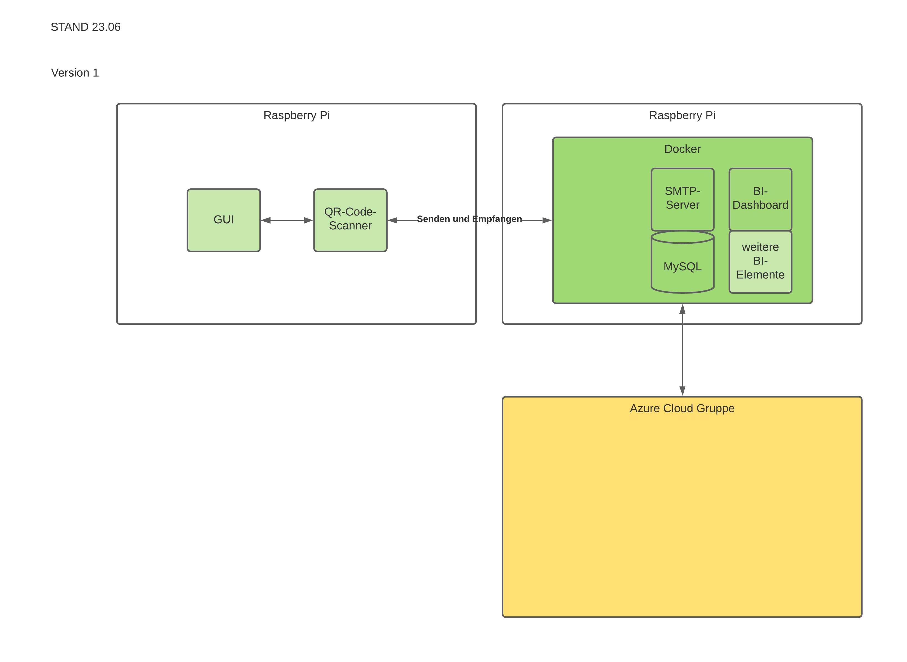
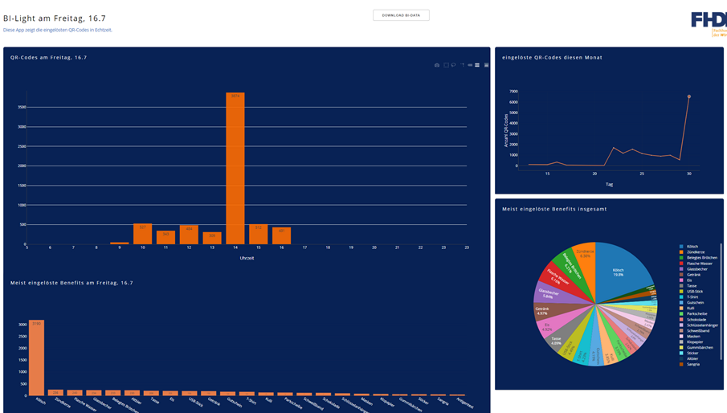

# AGI_QR_CODE_PROJEKT [30.06.2021]
Projekt für FHDW - Modul AGI

Besteht aus 
- QR-Scanner
- Dashboard mit Daten zu gescannten QR-Codes
- Export der Daten

Jedes .py-Programm mit "_main", stellt ein eigenes Programm dar. 

Es gibt zusätzliche Daten zu:
- Docker,
- BI-Export
- Datenbankchema

Für Docker-Image zum BI-Dashboard muss ein Docker-File mit einer eqquirements.txt-Datei angelegt werden.

## QR_Code - Scanner 
- QR-Daten aus eingelesene img-Dateien in einem Verzeichnis erkennen
- QR-Codes mithilfe einer Kamera erkennen 

Gobe Darstellung des Projekts: 

## Dashboard 
- BI-Informationen
- Eportfunktion

Gobe Darstellung des Dashboards: 

